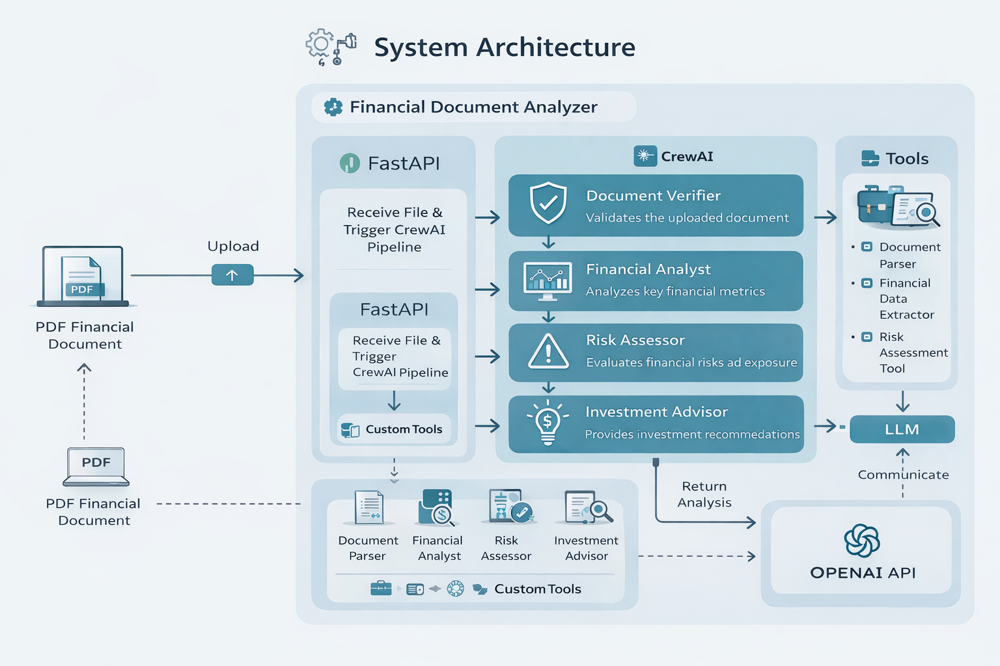

# 📊 Financial Document Analyzer (Refactored & Production-Ready)

## 📝 Project Overview

The **Financial Document Analyzer** is a multi-agent AI system built using CrewAI and served through a FastAPI backend.

The application allows users to upload financial documents (such as annual or quarterly reports) and receive structured insights including:

- 📄 Document validation  
- 📊 Financial analysis  
- ⚠️ Risk assessment  
- 💰 Investment recommendations  

The system simulates a team of financial experts — each agent has a defined responsibility, and tasks are executed sequentially to ensure logical information flow.

This version represents a fully debugged, stabilized, and refactored implementation after resolving major dependency conflicts, runtime errors, architectural issues, and security flaws.

---
## 🏗 Architecture Diagram

The following diagram illustrates the high-level flow of the multi-agent pipeline:

- User uploads financial document via FastAPI
- Document is validated by Verifier Agent
- Financial Analyst extracts key metrics
- Risk Assessor evaluates exposure
- Investment Advisor generates recommendation
- Final structured output returned to user

---

## 🐛 Major Issues Identified & Fixes Implemented

The original implementation contained multiple breaking issues at environment, framework, and code levels.

---

## 1️⃣ Environment & Dependency Stabilization

The initial setup suffered from severe package conflicts and framework incompatibilities.

### ✔ Version Conflicts Resolved

Conflicts involving:
- onnxruntime  
- pydantic  
- click  
- packaging  
- openai  
- langchain  
- chromadb  

were identified and resolved.

### ✔ CrewAI Framework Upgrade

The earlier CrewAI version caused internal incompatibilities.  
The project was migrated to a stable CrewAI release, resolving deep dependency and import issues.

### ✔ Removal of `crewai-tools`

A fundamental incompatibility existed between crewai and crewai-tools.

Instead of forcing unstable combinations:

- crewai-tools was removed  
- Required tools were re-implemented manually inside `tools.py`

This resulted in improved stability and fewer external conflicts.

### ✔ Clean & Stabilized `requirements.txt`

The requirements file was cleaned and pinned to prevent cascading dependency failures.

---

## 2️⃣ Code & Runtime Fixes

After stabilizing the environment, multiple runtime issues were resolved.

### ✔ Import Errors Fixed

Updated incorrect import paths after framework changes.

### ✔ LLM Initialization Fix

Fixed a `NameError` where the LLM variable was referenced before assignment.

### ✔ Tool Refactoring

Custom tools were rewritten to properly inherit from BaseTool and integrate correctly with CrewAI.

### ✔ FastAPI Stability Improvements

Resolved:

- Multipart upload issues  
- File cleanup handling  
- Sequential task execution flow  

### ✔ Model Update

Replaced deprecated OpenAI model references with supported models.

---

## 3️⃣ Prompt Engineering Overhaul

The original prompts were unstructured and logically inconsistent.

All prompts were rewritten to be:

- Professional  
- Structured  
- Goal-oriented  
- Context-aware  

### Logical Agent Flow

1. **Document Verifier** → Validates document type  
2. **Financial Analyst** → Extracts financial insights  
3. **Risk Assessor** → Evaluates financial exposure  
4. **Investment Advisor** → Provides structured recommendations  

Each task passes context to the next to maintain analytical consistency.

---

## 🏗 Project Structure
financial-document-analyzer/
│
├── main.py              # FastAPI app & endpoints
├── agents.py            # Agent definitions & LLM configuration
├── task.py              # Sequential CrewAI task pipeline
├── tools.py             # Custom financial tools
├── requirements.txt     # Stabilized dependencies
├── .gitignore           # Security & cleanup rules
└── README.md

### File Responsibilities

- **main.py**  
  Handles FastAPI initialization, file upload endpoint (`/analyze`), and orchestrates the Crew execution pipeline.

- **agents.py**  
  Defines all AI agents including:
  - Document Verifier  
  - Financial Analyst  
  - Risk Assessor  
  - Investment Advisor  

- **task.py**  
  Implements the sequential workflow ensuring logical execution order and context passing between agents.

- **tools.py**  
  Contains custom tools for:
  - Reading financial documents  
  - Handling document parsing  
  - Supporting agent execution  

---
## 🛠 Setup & Installation
### 1️⃣ Clone the Repository
- git clone https://github.com/<your-username>/<your-repo-name>.git
- cd <your-repo-name>

### 2️⃣ Create & Activate Virtual Environment
- python -m venv venv
- Windows: venv\Scripts\activate

### 3️⃣ Install Dependencies
- pip install -r requirements.txt
- The requirements.txt file is stabilized to avoid dependency conflicts.

### 4️⃣ Configure Environment Variables

- Create a .env file in the project root:
- GROQ_API_KEY=your_openai_api_key_here

- ⚠️ Important:
    - Do NOT commit .env
    - Ensure .gitignore excludes it

## 🚀 Running the Application

- Start the FastAPI server:
- uvicorn main:app --reload
- Server runs at: http://127.0.0.1:8000

## 📄 Using the Analyzer
- Open browser:
- http://127.0.0.1:8000/docs
- Expand POST /analyze
- Click Try it out
- Upload a PDF financial document
- Click Execute

### The response will contain:
- Financial summary
- Risk insights
- Investment analysis
- Agent execution logs will appear in the terminal.

## 🔐 API & Billing Requirements

- This project uses the OpenAI API.
- You must have:
- A valid OpenAI API key
- Active billing enabled
- Available usage quota
- If billing is not configured, you may encounter:
- 429 insufficient_quota
- Ensure your OpenAI account has sufficient credits.

## 📌 Key Improvements in This Version

- Stable dependency environment
- Removed conflicting external tools
- Secure API key handling
- Clean Git history
- Structured multi-agent workflow
- Professional prompt engineering
- Improved FastAPI file handling

## 🚀 Future Enhancements

- Local LLM integration (Ollama)
- Provider abstraction (OpenAI / Groq / Local)
- Structured JSON output mode
- Docker deployment
- Enhanced financial ratio extraction